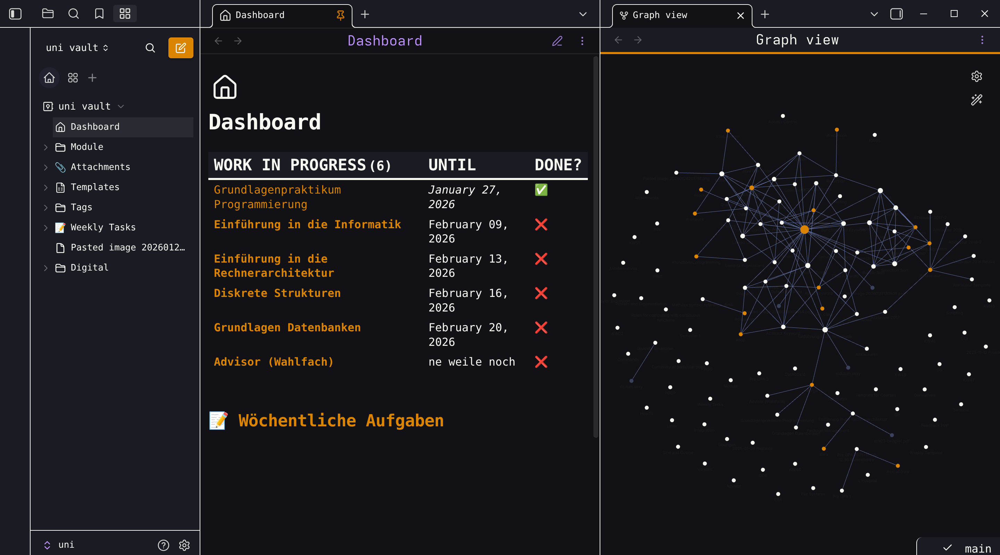

# Dracula for [Obsidian.md](https://obsidian.md)

> A dark theme for [Obsidian](https://obisidian.md), compatible to Obsidian V0.11.00

## Install

1. Download the obsidian.css file.

2. In Obsidian click Settings->Plugins and turn on "Custom CSS".

3. Put the "obsidian.css" in your vault root folder.

4. Restart Obsidian.

## Creator

This theme is created and maintained by jarodise. 
[Twitter](https://twitter.com/jarodise) / [Instagram](https://www.instagram.com/jarodise)

*The CSS modification of the newest version is based on ["Pisum" by MooddooM](https://github.com/GuangluWu/obsidian-pisum)

*This fork was modified by [allesman](https://allesman.net) 

## License

[MIT License](./LICENSE)
